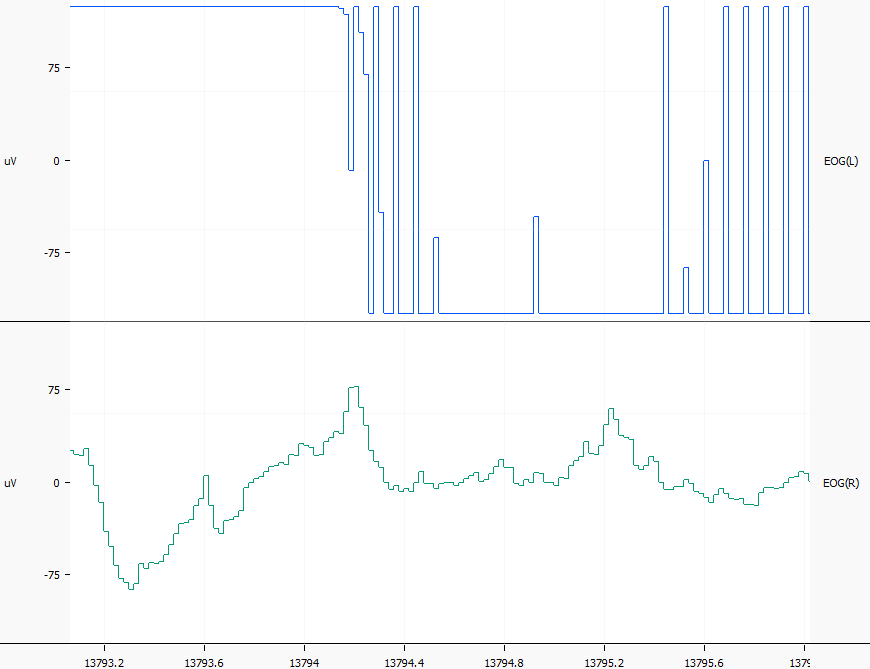
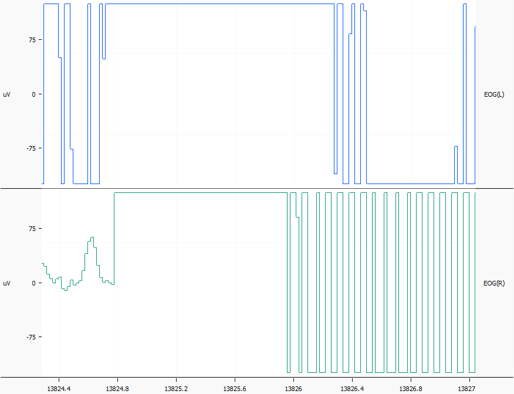

EOG: <emph>e</emph>lectro<emph>o</emph>culo<emph>g</emph>raphy
==============================================================

1 Introduction and background information: what is electrooculography and how it is approached in literature
-----------------------------------------
<dl>

<dt>Chang, Won-Du. ‘Electrooculograms for Human–Computer Interaction: A Review’. Sensors 19, no. 12 (14 June 2019): 2690. https://doi.org/10.3390/s19122690.</dt>
  <dd>
    Quite useful review of how various engineering groups used EOG signals in an applied way,
    while also exposing some of the tehcnical challenges and dilemmas.
  </dd>

<dt>Constable, Paul A., Michael Bach, Laura J. Frishman, Brett G. Jeffrey, Anthony G. Robson, and for the International Society for Clinical Electrophysiology of Vision. ‘ISCEV Standard for Clinical Electro-Oculography (2017 Update)’. Documenta Ophthalmologica 134, no. 1 (February 2017): 1–9. https://doi.org/10.1007/s10633-017-9573-2.</dt>
<dd></dd>

<dt>Creel, Donnell J. ‘Electroretinograms’. In Handbook of Clinical Neurology, 160:481–93. Elsevier, 2019. https://doi.org/10.1016/B978-0-444-64032-1.00032-1.</dt>
<dd></dd>

<dt>Frishman, Laura J. ‘Electrogenesis of the Electroretinogram’. In Retina, 177–201. Elsevier, 2013. https://doi.org/10.1016/B978-1-4557-0737-9.00007-2.</dt>
  <dd>
    Not strictly about EOG but the electroretinogram, which is a light-induced potential originating from retinal photoreceptors.
  </dd>

<dt>Iwasaki, Masaki, Christoph Kellinghaus, Andreas V. Alexopoulos, Richard C. Burgess, Arun N. Kumar, Yanning H. Han, Hans O. Lüders, and R. John Leigh. ‘Effects of Eyelid Closure, Blinks, and Eye Movements on the Electroencephalogram’. Clinical Neurophysiology 116, no. 4 (April 2005): 878–85. https://doi.org/10.1016/j.clinph.2004.11.001.</dt>
  <dd>
    The authors of this paper presumably focused on detecting and removing EOG as a nuisance artefact of EEG signals. Nonetheless useful insights, even from a negative perspective.
    Coupled with a small experimental study.
  </dd>

<dt>Malmivuo, Jaakko, and Robert Plonsey. Bioelectromagnetism: Principles and Applications of Bioelectric and Biomagnetic Fields. Oxford University Press, 1995. https://doi.org/10.1093/acprof:oso/9780195058239.001.0001.</dt>
  <dd>
    One of the few comprehensive reference works in the field of biosignals.
  </dd>

<dt>Marg, Elwin. ‘DEVELOPMENT OF ELECTRO-OCULOGRAPHY: Standing Potential of the Eye in Registration of Eye Movement’. A.M.A. Archives of Ophthalmology 45, no. 2 (1 February 1951): 169. https://doi.org/10.1001/archopht.1951.01700010174006.</dt>
  <dd>
    Very old paper that goes into pioneering experiments in the 19th and early 20th centuries.
  </dd>

<dt>Miyake, Yozo, and Kei Shinoda. ‘Clinical Electrophysiology’. In Retina, 202–26. Elsevier, 2013. https://doi.org/10.1016/B978-1-4557-0737-9.00008-4.</dt>
  <dd>
  </dd>

<dt>Robson, Anthony G., Laura J. Frishman, John Grigg, Ruth Hamilton, Brett G. Jeffrey, Mineo Kondo, Shiying Li, and Daphne L. McCulloch. ‘ISCEV Standard for Full-Field Clinical Electroretinography (2022 Update)’. Documenta Ophthalmologica 144, no. 3 (June 2022): 165–77. https://doi.org/10.1007/s10633-022-09872-0.</dt>
  <dd></dd>

<dt>Singh, Hari, and Dr Jaswinder Singh. ‘Human Eye Tracking and Related Issues: A Review’ 2, no. 9 (2012).</dt>
  <dd></dd>

<dt>Tao, Linkai, Hao Huang, Chen Chen, Loe Feijs, Jun Hu, and Wei Chen. ‘Review of Electrooculography-Based Human-Computer Interaction: Recent Technologies, Challenges and Future Trends’. Connected Health And Telemedicine 2, no. 3 (2023): 2000010. https://doi.org/10.20517/chatmed.2023.05.</dt>
  <dd></dd>
</dl>

2 Challenges specific to the signal samples we have
---------------------------------------------------

### 2.1 Gross artefacts of disconnection and saturation
The EOG signals that we got appear to be mostly unfiltered, apart from presumably some analog prefilters. Artefact regions are definitely present and they are apparently not annotated.

Probably the most obvious artefacts are those caused by poor electrode contact
or complete disconnection, which appear as high amplitude, high frequency waves.
They typically reach the ADC's min/max saturation values, and show signs of aliasing.

Saturation artefact on EOGL and normal signal on EOGR:

Saturation artefacts on both EOG channels:

**Proposed detection strategy:** moving average (mean) of the absolute signal amplitude
and static threshold (so far 80 &mu;V has worked fine),
given that the amplifier characteristics are a static boundary condition.
How many seconds (samples) to average over is an open question, nonetheless,
however for smoothness it would seem reasonable to have a window of at least several
seconds.

### 2.2 Interference from EEG and EMG
The EOG signal is very likely contaminated with frontal EEG to some extent (Iwasaki et al. 2004),
as well as presumably EMG.
The problem here is that the EOG channels cannot record this faithfully,
given that the **sampling frequency is just 50 Hz**.
Even some frequencies that are expected in EOG (up to 50 Hz, according to Tao et al. 2023)
must be filtered out before recording or will lead to aliasing.

This means that the signal has already been effectively low pass filtered, or worse,
contaminated by aliasing. Trying to filter out high frequency components at this stage
is futile.

**Proposed filtering strategy:** median filter (`medfilt1` in MATLAB) with *n* = 3,
perhaps *n* = 5 to remove potential outlier peaks while not distorting the waveform.

3 Feature selection and generation
----------------------------------
### Moving average of absolute signal
Introducing nonlinearity by taking the absolute value means that periodic
artefact signals do not cancel out to 0 mean. This could alternatively
be

### Continuous wavelet transform
Tao (2023) remarks that the relevant elements of EOG are non-periodic,
hence wavelet analysis is preferable to Fourier transform-based methods.

### Eye blinks
Eye blinks are a visual (time domain) feature, and in terms of feature input/presentation
to the ML algorithm it probably makes most sense to treat them either as binary feature
(blinks present/not present) or a numerical feature (e.g. blink count per epoch).
The second option is obviously more demanding and might not be worth the additional effort
to implement.

Based on the algorithm proposed by Pander, Przybyła and Czabański (2008), it was
determined that the best performance is indeed provided by an analogous
implementation, which consists of:
 * median filter of 5 samples
 * Parzen FIR filter of 100 taps, passband 1.5–8 Hz
 * squared signal
 * moving average of 18 samples (= 360 ms) length|
 * peak detection - propose 