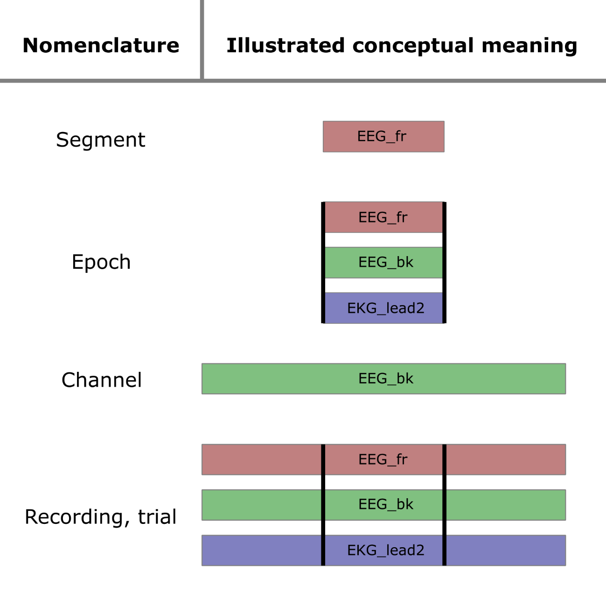

A glossary of standard nomenclature
===================================

To be used as a guide for names in code, documentation etc.

1 Elements of a recording
-------------------------
For clarity, the terms  <q>*segment*</q>, <q>*epoch*</q>, <q>*channel*</q>,
and <q>*recording*</q> should be used consistently to refer to describe the
structure of a biosignal recording.

Refer to the diagram below to understand 

